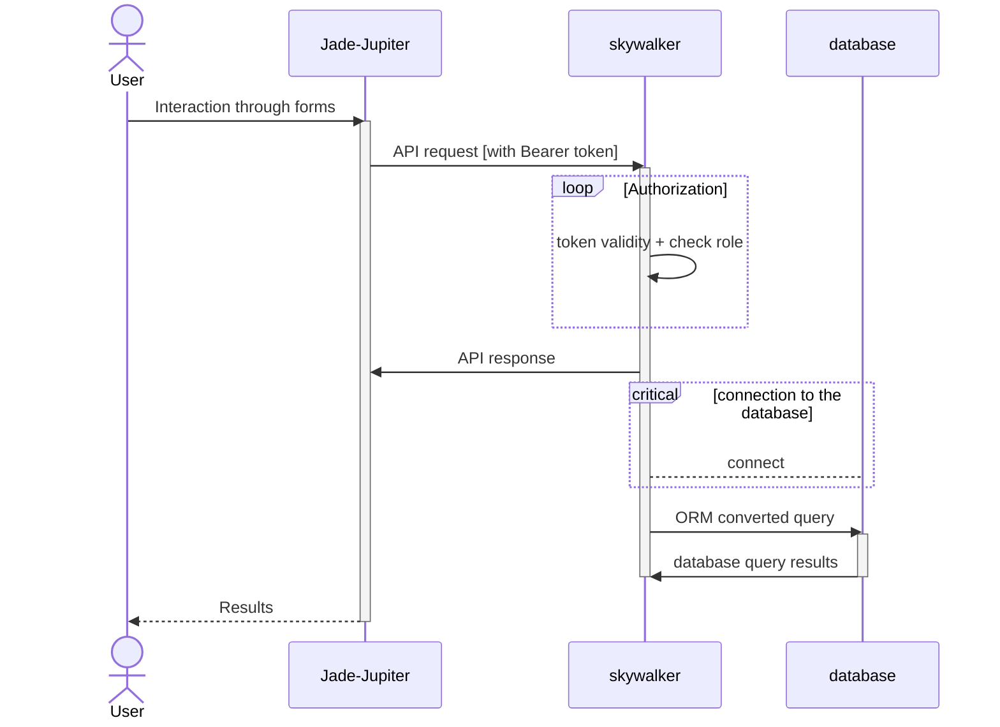
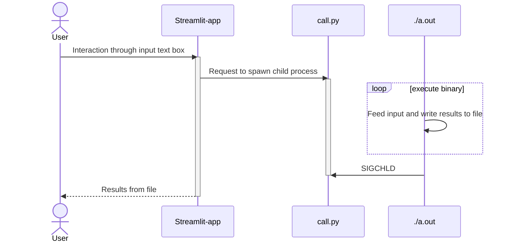

# Outer Rim &middot;

>The Outer Rim is a lawless place

Why this name: The largest region in the galaxy, also known as the Outer Systems, or simply the Rim, appears in the Star Wars universe.

Repository for all things related to Outer Rim.

## Repositories

- [skywalker](https://github.com/outer-rim/skywalker): Backend repo for DBMS Mini Project
- [Jade-Jupiter](https://github.com/outer-rim/Jade-Jupiter): Frontend repo for DBMS Mini Project
- [Query-Optimizer](https://github.com/outer-rim/Query-Optimiser): Term Project for DBMS
- [Sciatica](https://github.com/outer-rim/Sciatica): Term Project submission for IR

### DBMS Mini Project

### DBMS Term Project

### IR Term Project
