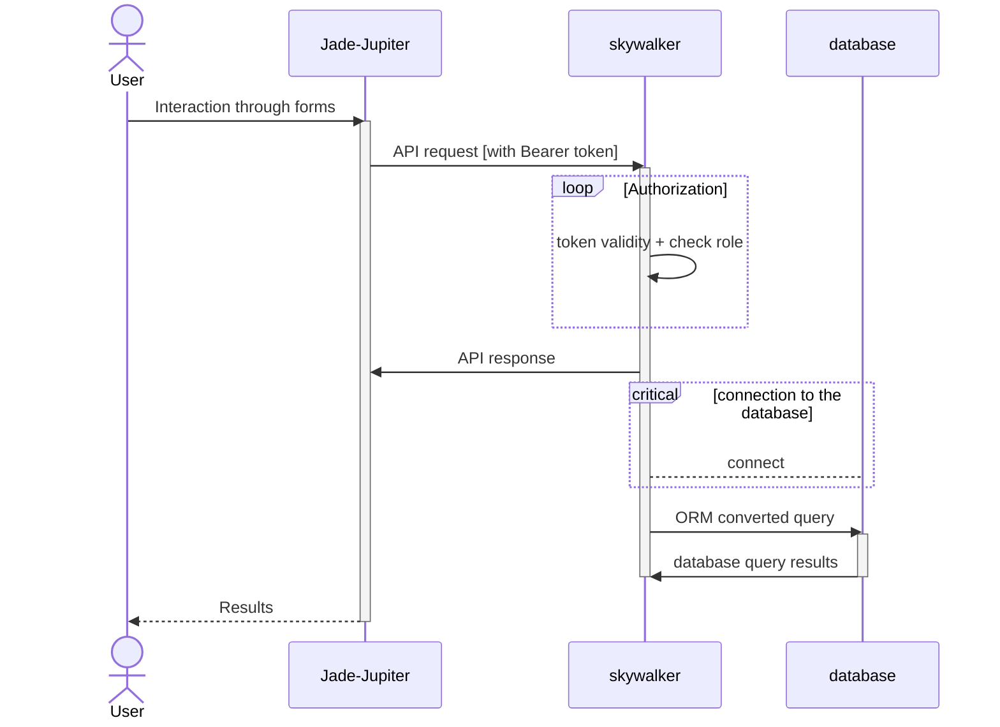

# Outer Rim &middot;

>The Outer Rim is a lawless place

Why this name: The largest region in the galaxy, also known as the Outer Systems, or simply the Rim, appears in the Star Wars universe.

Repository for all things related to Outer Rim.

## DBMS Mini Project

## DBMS Project

Coming soon...

## IR Project

Coming soon...
